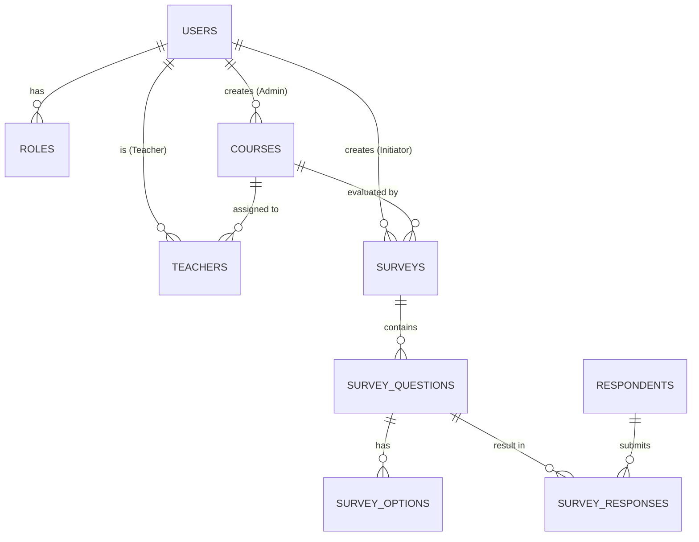

# Course Evaluation Survey System

A comprehensive web-based platform designed for educational institutions to collect feedback from students periodically. This system helps evaluate course quality and improves the overall learning experience using a data-driven approach.

## 🚀 Modern Technology Stack
This project has been upgraded to the latest industry standards as of early 2026:
*   **Java 25** (Oracle OpenJDK)
*   **Spring Framework 7.0.6**
*   **Spring Security 7.0.3**
*   **Jakarta EE 10** (Namespace migration from `javax.*` to `jakarta.*`)
*   **Tomcat 10.1.52**
*   **MySQL 8.0+**
*   **Maven 3.9+**

## 📖 Scenario & Project Overview
At the end of each academic term, institutions collect feedback to enhance teaching methods and curriculum. This system digitizes that process, allowing administrators to manage courses, survey initiators to design questions, teachers to track participation, and students (respondents) to submit their feedback securely.

## 👥 User Roles & Functionalities

### 1. Administrator
*   **Teacher Approval:** Validates and approves teacher registrations.
*   **Course Management:** Full CRUD operations on courses.
*   **Course Assignment:** Links approved teachers to specific courses.
*   **User Management:** Controls access and status for all system actors.

### 2. Survey Initiator
*   **Survey Design:** Creates surveys linked to courses.
*   **Question Builder:** Adds various question types (Single choice, Multiple choice, Text, Rating, Yes/No).
*   **Access Control:** Defines if a survey is private (Authenticated) or public (Guest).
*   **Results Analysis:** Real-time viewing of survey submissions and analytics.

### 3. Teacher
*   **Dashboard:** Views surveys active for their assigned courses.
*   **Participation Tracking:** Monitors how many students have responded.
*   **Results Access:** Views feedback specifically for their courses to improve teaching.

### 4. Respondents (Students / Guests)
*   **Submission:** Answers surveys either as a logged-in student or a guest.
*   **Email Verification:** Receives confirmation emails upon submission.

## 🏗️ System Architecture (Spring MVC)
The application follows the **Spring MVC** pattern ensuring a clean separation of concerns:
*   **Model:** POJO classes representing database entities (User, Course, Survey, etc.).
*   **View:** JSP files using JSTL tags (Jakarta namespace) for dynamic content rendering.
*   **Controller:** Jakarta-annotated classes handling HTTP requests and routing.
*   **Service Layer:** Business logic implementation (User approval, Survey publishing, Email alerts).
*   **DAO Layer:** Interface with MySQL using Spring `JdbcTemplate` for high-performance data access.

## 💾 Database Design (ERD)



### Key Tables:
*   `users`: Stores credentials, roles, and status (PENDING/ACTIVE).
*   `courses`: Catalog of institutional courses.
*   `surveys`: Master records for evaluation campaigns.
*   `survey_questions`: Categorized questions (RATING, TEXT, etc.).
*   `survey_responses`: Every individual answer submitted by a respondent.

## 🛠️ How to Run
1.  **Database Setup:**
    *   Execute the script in `/database/schema.sql` to create the schema and seed roles.
2.  **Configuration:**
    *   Update `src/main/resources/application.properties` with your MySQL credentials.
    *   Set your Gmail App Password for the `mail.*` properties if testing emails.
3.  **Build:**
    ```bash
    mvn clean install
    ```
4.  **Deploy:**
    *   Run on **Tomcat 10.1+**.
    *   The application root (`/`) will automatically redirect you to the **Login Page**.

## 🔑 Initial Credentials
*   **Username:** `admin`
*   **Password:** `Admin@1234`
