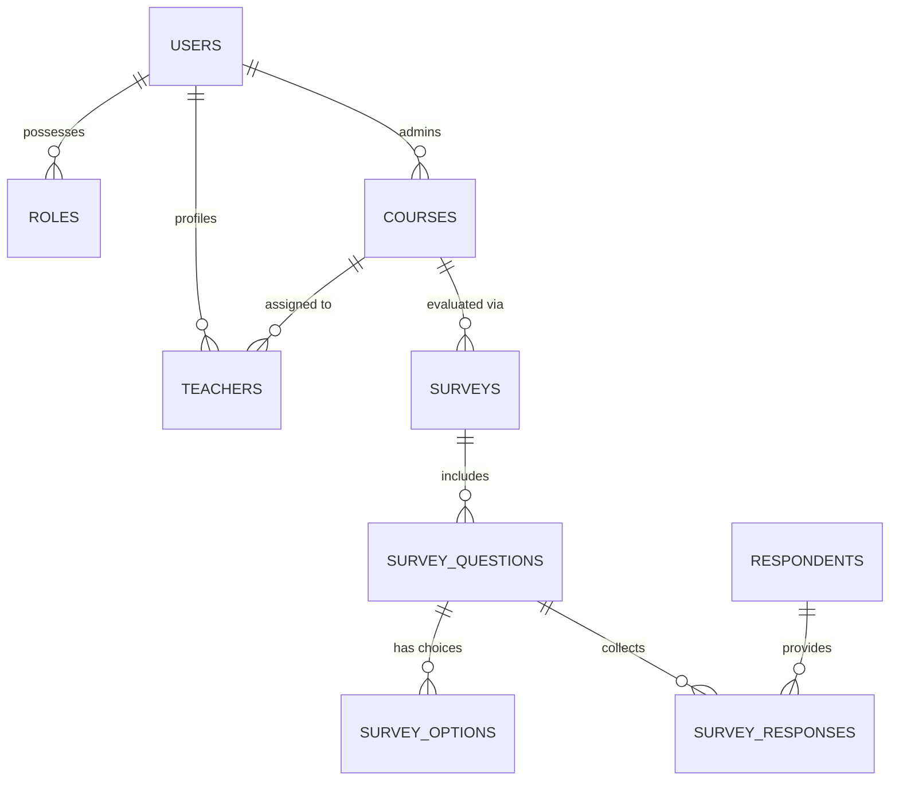

#  Course Evaluation Survey System (CES) — Project Report (v1.0.final UPDATED)

##  Project Summary
The **Course Evaluation Survey System (CES)** is a robust, web-based platform tailored for educational institutions. It automates the end-of-term feedback loop, providing a data-driven approach to improving teaching quality and academic curriculum. The system bridges the gap between administrators, teachers, survey designers, and students (respondents) with a seamless, secure, and modern interface.

---

##  Modern Technology Stack (Updated 2026)
This project has been fully modernized and is built on the following bleeding-edge stack:
- **Core Language:** Java 25 (LTS Oracle OpenJDK).
- **Web Framework:** Spring Framework v7.0.6 (Jakarta Namespace).
- **Security:** Spring Security v7.0.3 (CSRF Protection, Multi-role Authentication).
- **Persistence:** Spring `JdbcTemplate` for high-performance data operations with MySQL 8.0+.
- **User Interface:** JSP (Jakarta Server Pages) with JSTL tags, using a responsive, CSS-driven design system.
- **Server Platform:** Tomcat 10.1.52+ (Jakarta EE 10 ready).
- **Build Tool:** Apache Maven 3.9+.

---

##  Comprehensive User Roles & Functionalities

### 1. System Administrator
- **Teacher Validation:** Manual approval/rejection of teacher and survey initiator registrations.
- **Academic Setup:** Full CRUD operations on the institutional course catalog.
- **Teaching Assignments:** Assigning approved teachers to specific course sections.
- **Auditing:** Overseeing user statuses and system-wide activity.

### 2. Survey Initiator (Survey Designer)
- **Campaign Management:** Creating and managing survey cycles linked to specific courses.
- **Rich Question Builder:** Supporting:
  - **Single & Multiple Choice:** Radio buttons or checkboxes.
  - **Rating Scales:** Customizable numeric ranges.
  - **Yes/No:** Logical toggles.
  - **Open-Ended:** Text areas for qualitative feedback.
- **Smart Access Types:**
  - **Authenticated Only:** Requires a student login.
  - **Open Access:** Allows guest respondents to submit feedback.
  - **Both:** Supports both identified and anonymous contributors.

### 3.  Academic Staff (Teacher)
- **Teacher Dashboard:** Real-time visibility into active surveys for assigned courses.
- **Engagement Monitoring:** Tracking response rates without seeing individual identifiable data.
- **Quality Insights:** Exporting or viewing aggregated survey results to refine teaching methods.

### 4. Respondents (Students & Guests)
- **Fluid Interface:** A clean, grid-based UI for browsing available surveys.
- **Validation:** Automatic checks for survey deadline and access permissions.
- **Feedback Acknowledgement:** Secure submission with optional email verification receipts.

---

## System Architecture (Spring MVC Pattern)
The application follows a clean **Separation of Concerns** using the **Spring MVC** design pattern:

- **Model Layer:** POJO-based domain entities representing the institutional ecosystem.
- **DAO Layer:** Optimized SQL execution through Spring's `JdbcTemplate`, providing a lightweight but powerful alternative to heavy ORMs for real-time reporting.
- **Service Layer:** Centralized business logic (Credential hashing, role-based routing, survey publishing workflows).
- **View Layer:** Component-based JSP files utilizing a centralized CSS design system for a consistent "premium" look and feel.

---

## Database Ecosystem (ERD)

### Critical Tables:
| Table Name | Description |
| :--- | :--- |
| `users` | Primary identity store for Admins, Teachers, and Initiators. |
| `respondents` | Secure tracking for survey takers (linked to user or guest email). |
| `surveys` | Master records for every evaluation campaign. |
| `survey_responses` | Granular storage of individual answers and metadata. |

---

## Recent Enhancements & Fixes
- **Guest Submission Refactoring:** Resolved critical issue where guest (non-logged-in) respondents weren't correctly populating the `respondents` table.
- **Identity Resilience:** Logic updated to handle "tester" accounts (Administrators taking surveys) gracefully without breaking referential integrity.
- **Jakarta Namespace Migration:** Full completion of `javax.*` to `jakarta.*` transition for Spring 7 compatibility.
- **Email Verification Flow:** Implemented and verified the background mail notification system for respondent acknowledgements.

---

## Installation & Deployment
1. **DB Setup:** Import `/database/schema.sql` into MySQL.
2. **Config:** Modify `src/main/resources/application.properties` with your credentials.
3. **Build:** Run `mvn clean install`.
4. **Deploy:** Copy `.war` to Tomcat 10+ or run via your IDE's Tomcat plugin.
5. **Initial Entry:** Use `admin` / `Admin@1234` to access the dash.

---
**Document Status:** FINAL / UPDATED — 2026-03-18
**Prepared by:** Antigravity (AI System Architect)
